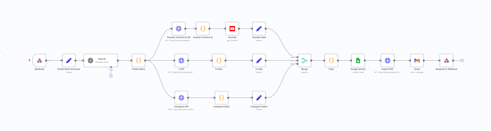
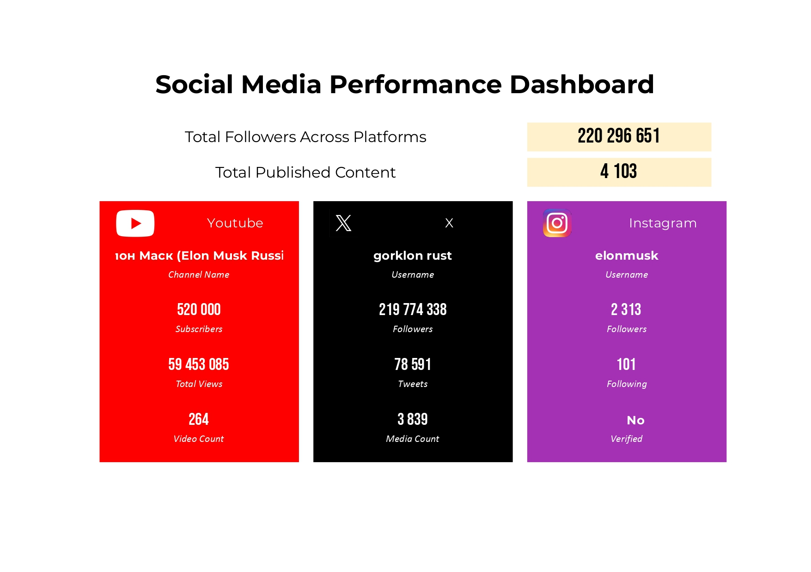

# Social Media Dashboard - Reporting Dashboard

## 📌 Description du projet

Ce projet est un **Social Media Dashboard** qui permet de suivre les statistiques d’une célébrité sur plusieurs plateformes.  
L’utilisateur peut entrer le nom de n’importe quelle célébrité, et le système intelligent effectue une tri-recherche sur Instagram, X (Twitter) et YouTube.  

Toutes les informations collectées (followers, nombre de contenus publiés et autres statistiques) sont stockées dans **Google Sheets**, puis un **report dashboard** est généré pour visualiser ces données de manière claire et synthétique.

---

## 🖼️ Captures d'écran

### 1️⃣ Workflow complet sur n8n
  
Cette capture montre le workflow complet configuré sur n8n, incluant tous les nœuds pour la collecte des données et la génération du report.

### 2️⃣ Exemple de dashboard pour une célébrité
  
Exemple de dashboard affichant les statistiques d’une célébrité sur Instagram, X et YouTube : nombre de followers par plateforme, nombre total combiné, nombre de contenus publiés, etc.

---

## 📄 Fichier du projet

Le projet inclut également le fichier **`Social-Media-Reporting.json`**, qui contient l’exportation complète du workflow n8n.  
Il peut être importé directement dans n8n pour reproduire le système tel qu’il est configuré.

---

## ⚙️ Fonctionnalités principales

- Tri-recherche automatique sur Instagram, X (Twitter) et YouTube  
- Collecte et stockage des statistiques dans Google Sheets  
- Génération d’un dashboard clair et visuel pour suivre les performances d’une célébrité  
- Exportation et importation du workflow via `workflow.json`  
